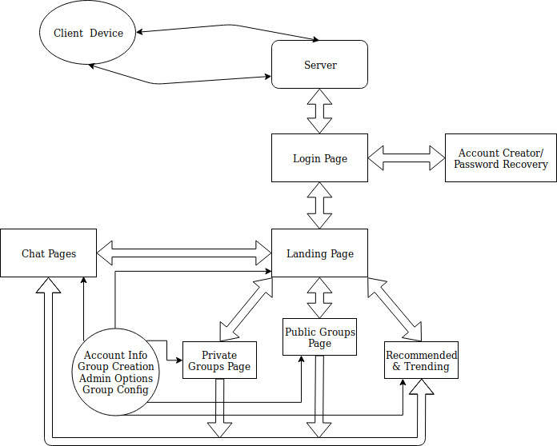

#Meeting Notes

## Details/Features (3/29 Meeting)

- Storage of message history on remote server
- Public & private groups
- Public groups are created by developers & can be requested
- Groups will be deleted after a certain amount of inactivity
- Threshold set on storage for message history
- Username, hobbies, etc. will be collected at account creation
- Groups will be only accessible for people in a certain area (gps coordinate will be used)

## Specifications (4/1 Meeting)
- **2** Months of inactivity until private groups get deleted
  - Notification sent to user as warning
- Private groups have a cache that is stored on **their** respective devices
  - All history is stored on respective devices
- Public Groups managed by **Developers**
- Admin or private groups is **Creator** of the group
  - Can be transferred between users
  - Can kick people out of Groups
  - Developers are super users
- **Personal/User** information stored
  - Username, Password, Email Address
  - Hobbies Interest
  - Current City
  - Mac Address
  - ?Profile Picture?
- **Award System** implementation
  - Trophies for days active and membership
  - Trophies for users and groups
- _Login Page_
  - Username and Password
  - Account recovery info sent to Email
- _Landing Page_
  - Your Groups, Public Groups, Potential/Recommended groups
  - A link to configure account info
  - Search bar for finding public groups
- _Creation of group / group Page_
  - Name of groups
  - Typical meeting place
  - Description of group
  - admin username
  - Number of people in group

## Landing Page/Markups (4/3)
  - **KJ HTML Template Improvements for Landing Page**
    - Color of Notification Bar #FFED3F
    - Center brand name in the center of the navigation bar
    - More Spacing in between options/Bigger Text
    - Account information on far right after search bar
  - **Mockup Pages**
    - Login
    - Account Recovery/Forget Password
    - Landing/Main
    - Private
    - Public
    - Recommended/Trending
    - Chat
    - Account Info/Admin Options/Group Config
    - Group Creation

## Overview of Pages (4/6)

  - **Navigation Bar** Left to right
    - Public Private Discovery (Name with logo) Search_Bar Account_Settings
  - **Account Settings** Drop Down Options
    - Account information
    - Bookmarks
    - Create Private Group
    - Request Public Group
    - Inactive Groups
    - Logout
  - **Private/Public group page**
    - Notifications/Silence Icon 
    - Event Creation/Calendar
      - Link to google Calendar
    - Link to Chat
    - Terminate membership
    - Description
    - Location
    - Awards
  - **Account info**
    - Profile Picture
    - Interest/hobbies
    - Location (city)
    - Change email/password
    - Admin settings for groups
